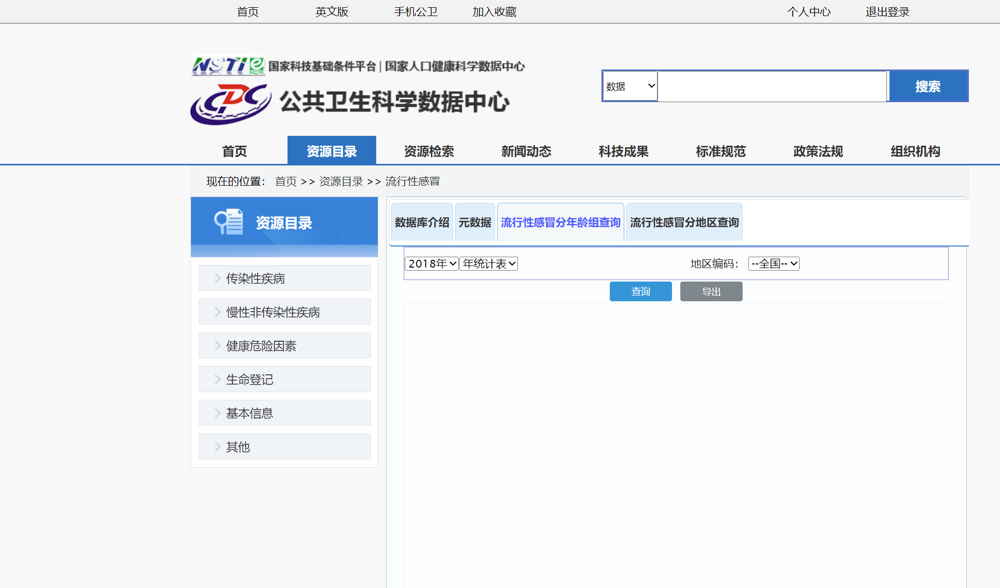

# phsciencedata_crawler_region
 公共卫生数据科学中心（https://www.phsciencedata.cn/）

# 疾病数据分地区/分省份爬虫

懒得写用法了，真有人用提个issues我再update……

使用教程：

## 登录网站

打开download.py并运行

疾病id为：进入网站的首页后点击自己想要爬取的疾病（以流感为例）

**点击查询**

**点击导出**

**复制导出链接**

https://www.phsciencedata.cn/Share/frameset?
report=ReportAgeMonth.rptdesign&title=&
showtitle=false&toolbar=true&navigationbar=true&&
format=xls&locale=zh_CN&clean=true&
filename=%E5%8D%A0%E4%BD%8D%E7%AC%A6&years=2018&
**_diseaseId=139_**
&months=1&&pi=96&__asattachment=true&__overwrite=false

### 此处id就为139

## 运行process即可把爬取的数据进行合并