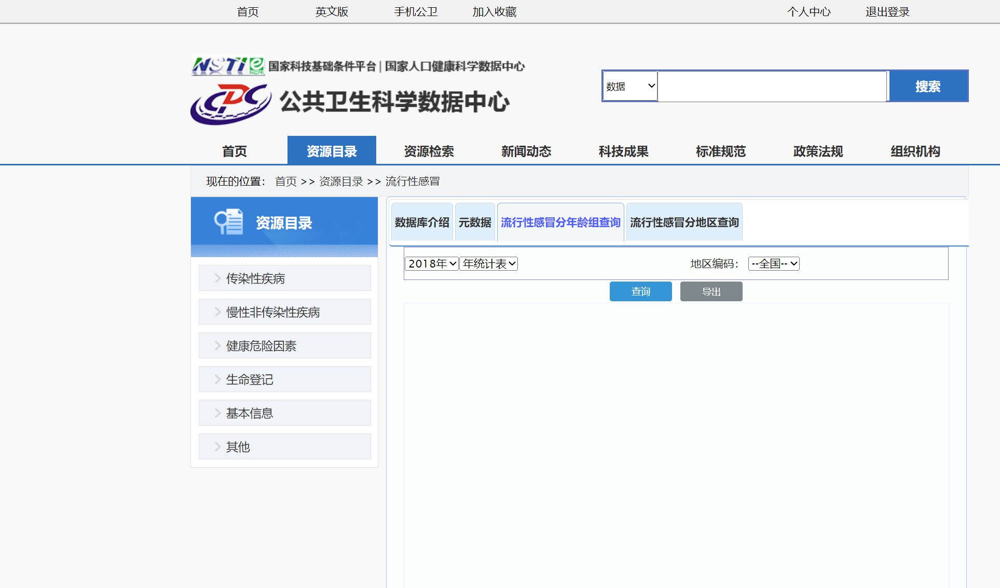

# phsciencedata_crawler
公共卫生数据科学中心（https://www.phsciencedata.cn/）

# 疾病数据分年龄/分地区爬虫

## 使用教程

## 环境依赖

运行前请先安装依赖：

```bash
pip install pandas requests
```

### 1) 登录网站并导出链接

打开 `download.py` 并运行，按提示输入：

- 起始年份
- 终止年份
- 疾病 ID
- 下载类型（`age` 或 `region`）

疾病 ID 获取方式：进入网站首页后点击想爬取的疾病（以流感为例）。



点击查询 -> 点击导出 -> 复制导出链接，链接中 `_diseaseId` 对应的值就是疾病 ID。

示例（节选）：

```
https://www.phsciencedata.cn/Share/frameset?...
...&years=2018&diseaseId=139&months=1...
```

这里 `diseaseId=139`，即疾病 ID 为 `139`。

### 2) 合并月度数据

运行 `process.py`，按提示输入：

- 起始年份
- 终止年份
- 疾病 ID
- 处理类型（`age` 或 `region`，需与下载类型一致）

输出：`{疾病ID}/final.csv`

### 3) 月度转年度汇总

运行 `sum_script.py`，按提示输入：

- 疾病 ID
- 汇总类型（`age` 或 `region`，需与前一步一致）

输出：

- 年龄维度：`{疾病ID}/年龄分组_year_final.csv`
- 地区维度：`{疾病ID}/地区_year_final.csv`
